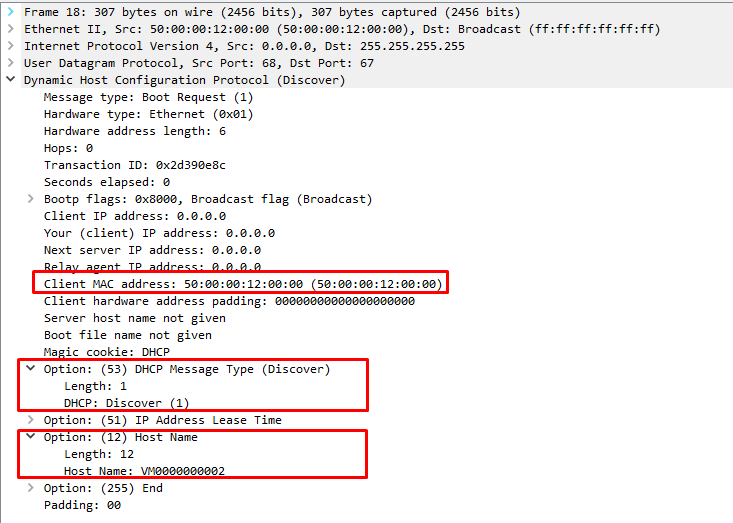

# Zero touch provisioning (ZTP) (include DHCP/TFTP/HTTP)<br>
Python3 script which using YAML file as host config to offer DHCP/IP for device.<br>
System sniff DHCP packets and answer using own build DHCP responses (based on scapy library)<br>
Built-in TFTP/HTTP servers allow host download config/firmware which was pointed in dhcp option.<br>
<br>
<i>No more installing Isc/Kea DHCP and configuring DHCP scopes/TFTP/HTTP... </i> 

## Syntax:
```console
[root@server ztp]# ./ztp.py -h
usage: ztp.py [-h] [-i INTERFACE] [-l LIMIT] [-p PATH] [--port_tftp PORT_TFTP]
              [--port_http PORT_HTTP] [-d PCAP]

optional arguments:
  -h, --help            show this help message and exit
  -i INTERFACE, --interface INTERFACE
                        Interface to service requests
  -p PATH, --path PATH  TFTP folder path. Set `None` to disable TFTP
  --port_tftp PORT_TFTP
                        TFTP port
  --port_http PORT_HTTP
                        HTTP port
  -d PCAP, --pcap PCAP  collect PCAP file name for debug
```

## Memory consumption:
```console
[root@server ztp]# pmap 3068 | grep total
 total           410900K
```

## Example:


### Config Yaml file example:
```yaml
VM0021210000:
  mac: 50:00:21:21:00:00
  hostname: Spine-21
  domain: juniper.lab
  ip: 10.240.40.21
  subnet_mask: 255.255.252.0
  router: 10.240.40.1
  name_server: 8.8.8.8       // (only SINGLE server supported)
  lease_time: 60
  tftp_server_name: 10.240.40.254
  boot-file-name: juniper.config
  tftp_server_address: 10.240.40.254
  vendor_specific: 0:junos.tgz,1:VM0021210000/juniper.sh,3:http
```
<br>
Config needs to be store in tftp folder in single / or multiple yaml files.<br>
Configs are checked/read everytime when new dhcp Discovery pacet would be capture.<br> This consuming some resorces (utlize disk) but allow you 'in fly' modyfie config without restarting ztp instance.<br>
YAML Config format:<br>

```yaml
<hostname/name>:
  mac: <mac - allow format with seperators like .:->
  <parameter>: <value>
```
In some cases new unboxed device report as <b>hostname</b> their serial number so in this situation, if script discovery that hostname inside Discovery message match this <i><hostname/name></i> - it will use this config section to send Offer.<br>
  


If <b>hostname/name</b>  will not be found in config files - it will check in 2nd step - <b><i>mac</i></b> match - for DHCP request in all configs.<br><br>
<b>parameters</b> are related to scapy dhcp layer lib which can be found under this [Link](https://github.com/secdev/scapy/blob/master/scapy/layers/dhcp.py) -> DHCPOptions<br>
Please note that parameters <b>tftp_server_name</b> (option 66) and <b>tftp_server_address</b> (option 150) are missing in scapy layer lib so it needs to be added manually:<br>
  
```bash
sed -i 's/    67: StrField/    66: "tftp_server_name",\n    67: StrField/g' /usr/local/lib/python3.6/site-packages/scapy/layers/dhcp.py
sed -i 's/    255: "end"/    150: IPField("tftp_server_address", "0.0.0.0"),\n    255: "end"/g' /usr/local/lib/python3.6/site-packages/scapy/layers/dhcp.py
```
Scapy issie [2747](https://github.com/secdev/scapy/issues/2747)
